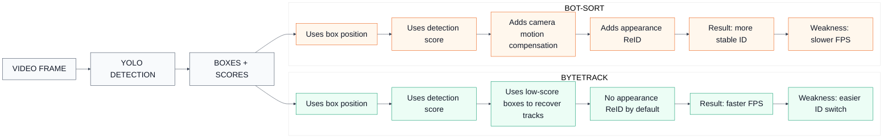
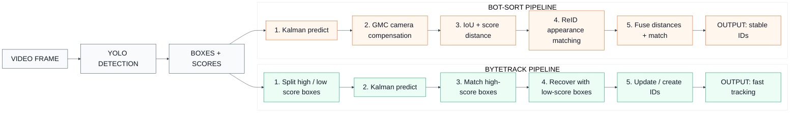

# Pipeline Flowchart: ByteTrack vs BoT-SORT

File này trình bày sự khác nhau giữa `ByteTrack` và `BoT-SORT` theo thứ tự: flowchart trước, giải thích sau.

## 1. Sự Khác Nhau Cốt Lõi

## 2. Pipeline Đặt Cạnh Nhau

## 3. Giải Thích Khác Nhau

| Tiêu chí | ByteTrack | BoT-SORT |
|---|---|---|
| Thông tin chính dùng để tracking | Vị trí box, IoU, confidence score | Vị trí box, IoU, confidence score, camera motion, appearance |
| Cách giữ ID | Ghép track cũ với detection mới bằng chuyển động và overlap box | Ghép bằng chuyển động + overlap box + bù chuyển động camera + đặc trưng ngoại hình |
| Low-score detection | Dùng rất mạnh để cứu track bị yếu confidence | Có dùng logic kế thừa từ ByteTrack, nhưng thêm các cue khác |
| ReID appearance | Không phải trọng tâm chính | Là điểm mạnh quan trọng khi bật `with_reid` |
| Camera motion compensation | Không phải phần chính | Có GMC, hữu ích khi camera rung hoặc di chuyển |
| Tốc độ FPS | Thường nhanh hơn | Thường chậm hơn |
| Độ ổn định ID | Tốt trong cảnh đơn giản, ít che khuất | Tốt hơn trong cảnh đông người, che khuất, người cắt nhau |
| Rủi ro chính | Dễ đổi ID hơn khi hai người gần nhau hoặc bị che | Tốn tài nguyên hơn, giảm FPS |

## 4. Hiểu Ngắn Gọn

`ByteTrack` cố gắng giữ ID bằng cách tận dụng cả detection mạnh và detection yếu. Khi một người bị che khuất nhẹ hoặc confidence giảm, detection đó có thể rơi xuống nhóm low-score. ByteTrack vẫn dùng nhóm này để nối lại track cũ, vì vậy thuật toán nhẹ và nhanh.

`BoT-SORT` mở rộng ý tưởng tracking bằng box của ByteTrack, nhưng thêm hai nguồn thông tin quan trọng: `GMC` để bù chuyển động camera và `ReID` để so sánh ngoại hình người. Vì vậy BoT-SORT thường giữ ID tốt hơn trong cảnh khó, nhưng phải trả giá bằng tốc độ thấp hơn.

## 5. Khi Nào Chọn Thuật Toán Nào

- Chọn `ByteTrack` nếu ưu tiên FPS, realtime, chạy trên Jetson/edge, và ID switch chỉ tăng nhẹ.
- Chọn `BoT-SORT` nếu cảnh có nhiều người giao nhau, che khuất lâu, camera rung/di chuyển, hoặc yêu cầu giữ ID quan trọng hơn tốc độ.
- Với kết quả bạn quan sát được, nếu `ByteTrack` chỉ kém `BoT-SORT` một chút về ID nhưng FPS tăng gần gấp đôi, `ByteTrack` là lựa chọn thực dụng hơn cho chạy thật.
